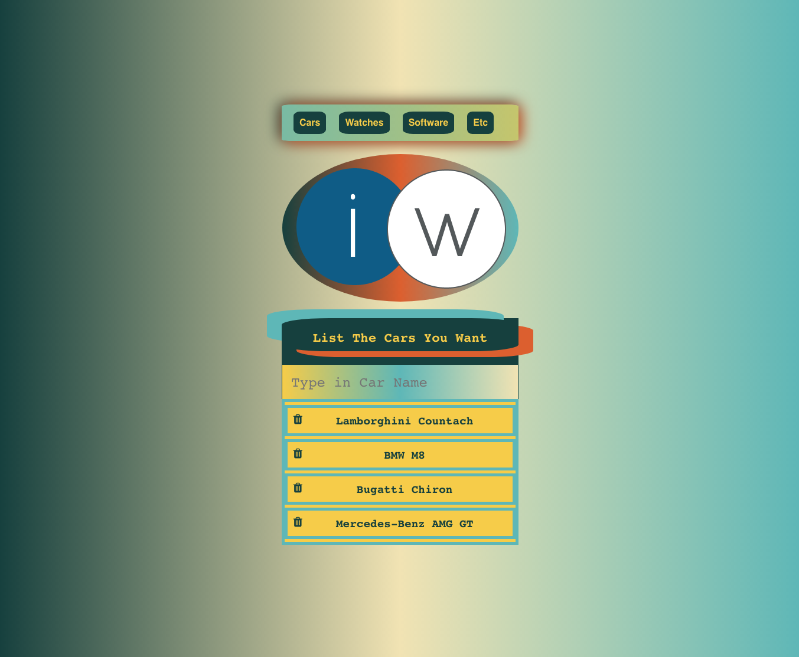
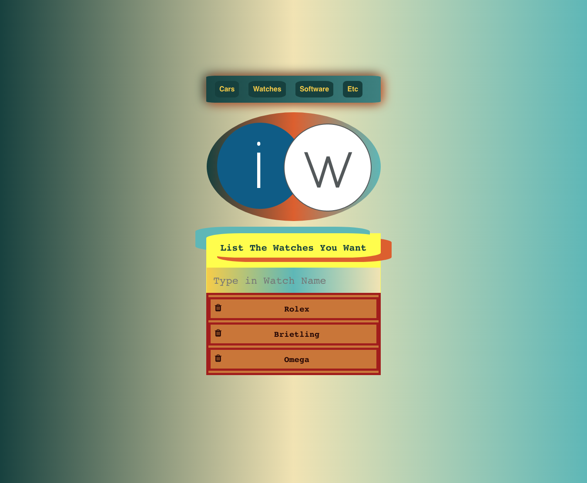
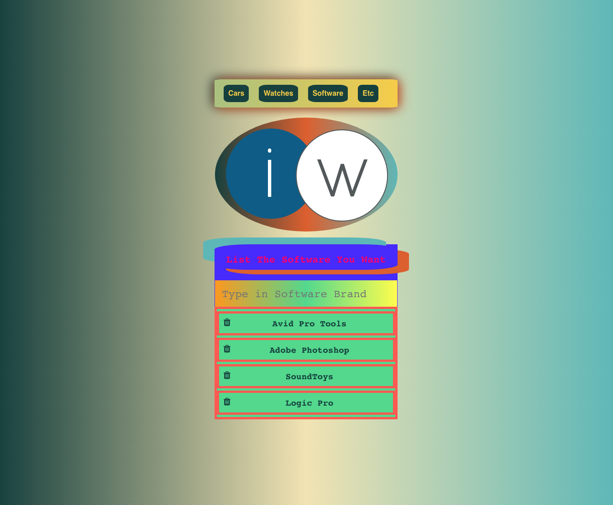
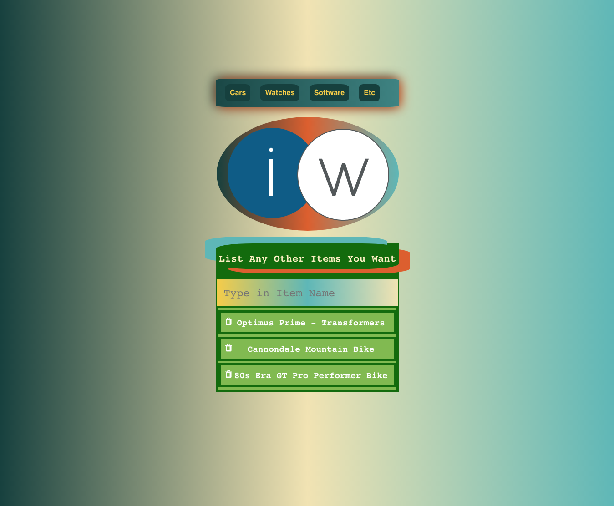

# [iWant](https://iwant-app.herokuapp.com)
#### Please Click App Name Above to View Heroku Deployment
 

  

  
  
  

Author: [Amit Zaman](https://amitzaman.com)

#### Technologies Used:
##### VUE
##### Bootstrap
##### Heroku

##### While building this VUE app, the original dependency used was Yarn (while building locally on localhost:8080) but it was removed and Node server and a server.js file was installed and added, respectively, in order to allow deployment to Heroku while still successfully being able to add/edit final touches now on localhost:5000.  

#### The app has four pages to add different items, and can be expandable to add more.  When entering items, there must be at least 3-characters in the entry, and will stretch-animate until the correct amount of characters are added to the entry.  VUE default setting was used when creating the project and routes were manually installed near the end of development.

#### When adding and deleting an item, css animations playfully indicate the action.  The routing allows for easy navigation between the pages.

#### To see the app's Heroku deployment, click the iWant name/link above or you can view [here](https://iwant-app.herokuapp.com).

##### [Amit](https://github.com/amitzed)
